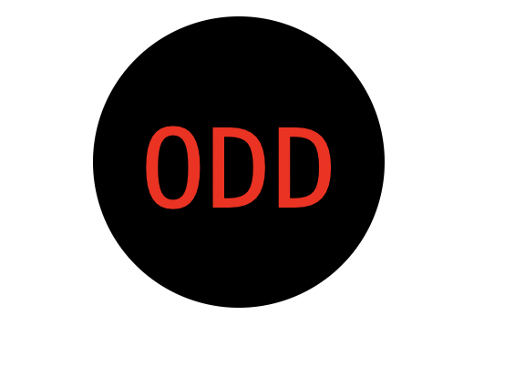

# SVG-Logo-Maker

## Logo Generator

This is a simple Node.js application that generates logos based on user input. It allows you to choose a shape (Circle, Triangle, or Square), customize text, text color, font family, and shape color, then generates an SVG file as the output.

## Prerequisites

Make sure you have Node.js installed on your machine.

## Installation

1-Clone this repository to your local machine.

2-Navigate to the project directory in your terminal.

3-Install dependencies.

## Usage

Video Link: https://drive.google.com/file/d/18x6KtFoZ_A-iTjeg64R4RJq0MDAh3TrG/view

## Follow the prompts to customize your logo:

1-Enter the three characters you want on your logo.

2-Choose the text color.

3-Select a font family for the text (optional).

4-Choose a shape (Circle, Triangle, or Square).

5-Specify the color for the selected shape.

6-Confirm your choices.

7-Once you confirm your selections, the application will generate an SVG file named logo.svg in the examples directory.

## Customization

Feel free to modify the code to add more shapes, customize the SVG output, or enhance the user experience.

## Dependencies

fs: Node.js built-in module for file system operations.

inquirer: A collection of common interactive command-line user interfaces.

## License

This project is licensed under the MIT License - see the LICENSE file for details.
